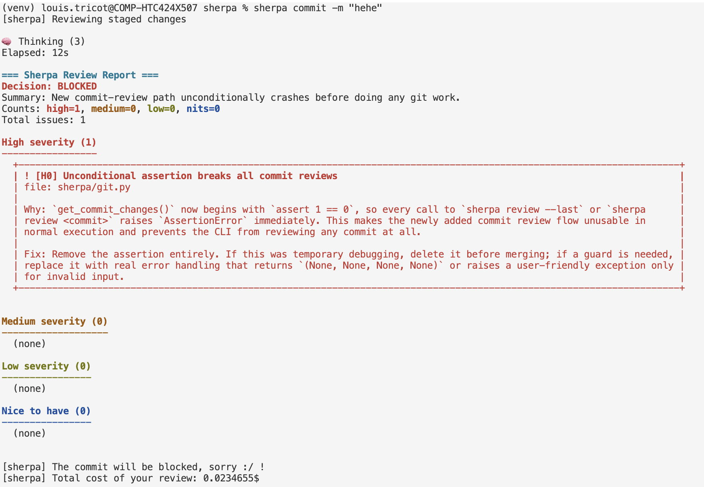
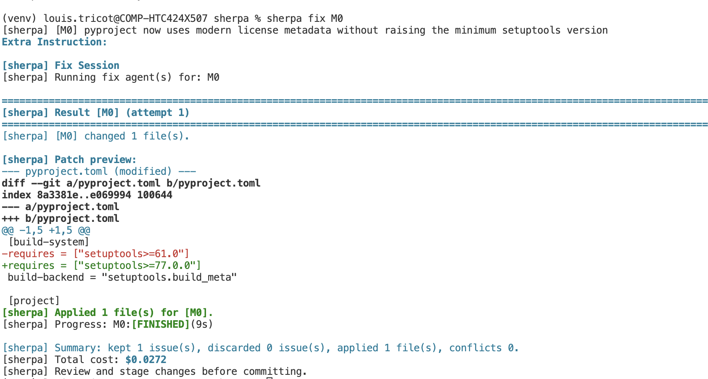
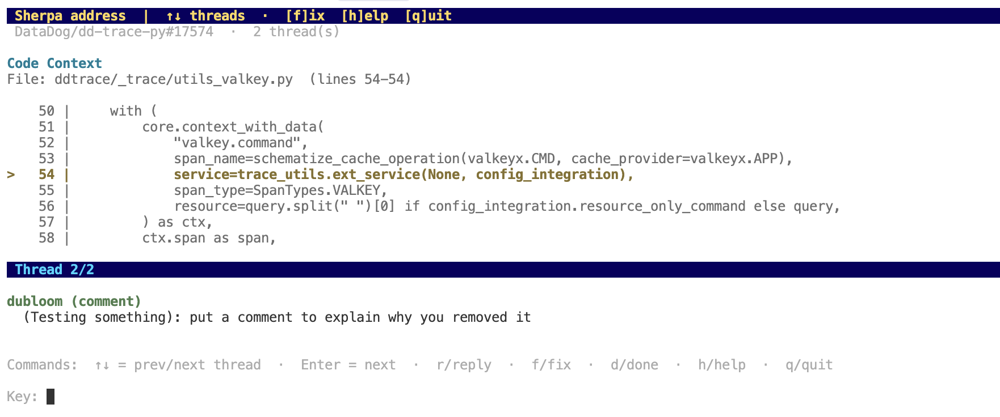

# sherpa

`sherpa` is a CLI tool that runs an AI code review locally on your changes before you commit.

## Install

```bash
pipx install "git+https://github.com/dubloom/sherpa.git"
```

## Configuration

If `--model` is not provided, Sherpa uses `.sherpa/config.json`.

On first launch, if no config is found, Sherpa starts an interactive setup to choose:
- default model (from the supported models list)
- default reasoning effort (`low`, `medium`, `high`)

It then creates:

```json
{
  "default_model": "gpt-5.3-codex",
  "default_reasoning_effort": "medium"
}
```

`default_reasoning_effort` only applies to OpenAI models and must be one of:
- `low`
- `medium`
- `high`

To update config later:

```bash
sherpa config
```

## Usage

### `sherpa commit`: review before committing

Run an AI review on your **staged** changes, then commit if approved:

```bash
sherpa commit -m "my commit message"
```

<p align="center">
  
</p>

`sherpa commit` is intended to work like `git commit`:
- all arguments passed after `sherpa commit` are forwarded to `git commit`
- you can still pass your regular commit flags/message

Choose a model for that run:

```bash
sherpa commit --model claude-opus-4-5 -m "my commit message"
```

For OpenAI models, you can also set reasoning effort explicitly:

```bash
sherpa commit --model gpt-5.3-codex --reasoning high -m "my commit message"
```

For default model and reasoning-effort behavior, see the [Configuration](#configuration) section.

Review feedback can include four categories:
- High (errors, blocks commit)
- Medium (warnings, does not block commit)
- Low (debug-level feedback, does not block commit)
- Nice to have

Each issue/nit gets an identifier you can use in the fix stage.

When a commit is approved via `sherpa commit`, Sherpa appends an `Approved-By: <model_name>` trailer to the commit message.

### `sherpa fix`: fix selected issues

Use `sherpa fix` to select one or more issues from the latest stored review and apply fixes.

When multiple issues are selected, Sherpa can run fixes in parallel using separate git worktrees.

```bash
sherpa fix
```

<p align="center">
  
</p>

Target specific issue IDs:

```bash
sherpa fix H0 M1
```

Before each selected fix task starts, Sherpa prompts:

```text
Extra Instruction:
```

Leave it blank to run without extra instructions.

### `sherpa review`: run standalone reviews

Review staged changes (default):

```bash
sherpa review
```

Review a specific commit:

```bash
sherpa review <commit>
```

Quick review workflows:

```bash
sherpa review --last
sherpa review --branch
```

Combine with global options like `--model`:

```bash
sherpa --model claude-haiku-4-5 review --branch
```

### `sherpa address`: address pull request feedback

Use `sherpa address` to browse GitHub PR comment threads in your terminal, reply, and run a fix flow for a selected thread.

```bash
sherpa address
```

<p align="center">
  
</p>

`sherpa address` must be run in the right repo and on the right branch to benefit from the right code location.

By default, Sherpa infers the current PR from your branch and `origin` remote but you can also target a PR explicitly:

```bash
sherpa address https://github.com/<owner>/<repo>/pull/<number>
```

Prerequisites:
- `GITHUB_TOKEN` must be set (for GitHub API calls)
- `origin` must point to GitHub (for PR inference)

Inside the address UI you can:
- navigate threads (`Enter`/`next`, `back`/`prev`, and `↑`/`↓` in interactive terminals)
- reply to a thread (`r` or `reply`)
- run an AI-assisted fix flow for the current thread (`f` or `fix`)
- mark a thread as done in the local session (`d` or `done`)